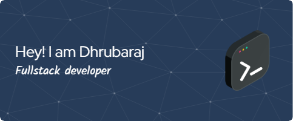

<a href="https://drive.google.com/file/d/1PCj_ZYHuasniL4ebGbi3haLy-QIwKNTQ/view?usp=sharing">My PortFolio</a>

<h3 align="center">A passionate FullStack developer from India</h3>

- 🔭 I’m currently working on **Multiuser IDE**

- 🌱 I’m currently learning **WebRTC**

- 👨‍💻 All of my projects are available at [https://therajhub.github.io/Rajhub/](https://therajhub.github.io/Rajhub/)

- 💬 Ask me about **Web Development, ML, DL,**

- 📫 How to reach me **dhruborajdey@gmail.com**

- 📄 Know about my experiences Backend Internship in a Startup Jag Education

- ⚡ Fun fact **I am a Dancer too**

<h3 align="left">Connect with me:</h3>

<h3 align="left">Languages and Tools:</h3>

               

<h3 align="left">Support:</h3>

  
